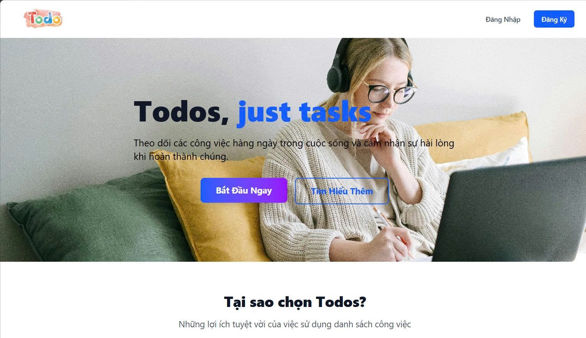

# MERN ToDoList


Project quản lý công việc với MERN:

- `Todo_Client`: React + Vite
- `Todo_Server`: Express + MongoDB
- `docker-compose.yml`: chay đồng thời frontend + backend + database

## 1) Yêu Cầu

- Node.js >= 18
- Docker Desktop (hoac Docker Engine + Docker Compose)

## 2) Chạy với Docker

Từ thư mục gốc project:

```powershell
docker compose up --build
```

Chạy nền:

```powershell
docker compose up -d --build
```

Dừng hệ thống:

```powershell
docker compose down
```

Xóa volume volume database:

```powershell
docker compose down -v
```

### Port mặc định

- Sau khi start thành công có thể truy cập với port frontend: http://localhost:5173
- Backend: http://localhost:8000
- MongoDB: mongodb://localhost:27017

## 3) Chạy local không dùng Docker

### 3.1 Backend

```powershell
cd Todo_Server
npm install
```

Tao file `.env` trong `Todo_Server`:

```env
MONGO_URL=mongodb://127.0.0.1:27017/todoapp
JWT_SECRET=supersecretkey
PORT=8000
ALLOWED_ORIGINS=http://localhost:5173
NODE_ENV=development
```

Chạy backend:

```powershell
npm run dev
```

### 3.2 Frontend

```powershell
cd ..\Todo_Client
npm install
```

Tao file `.env` trong `Todo_Client`:

```env
VITE_BACKEND=http://localhost:8000
```

Chạy frontend:

```powershell
npm run dev
```

Truy cập tại: http://localhost:5173
